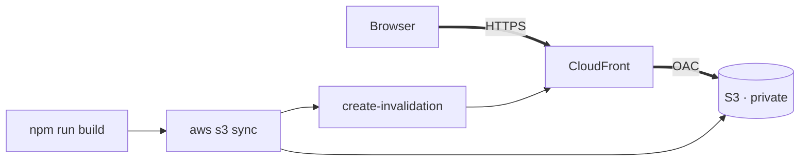

# Portfolio

Personal portfolio site. Live at <https://d3vb54akunf9wi.cloudfront.net>

## Stack

- React + Vite
- Deployed to a private S3 bucket behind CloudFront

## Architecture

Thick arrows are the request path, thin arrows the deploy.



The bucket is only reachable through the distribution: its policy grants
`s3:GetObject` to the `cloudfront.amazonaws.com` service principal alone,
conditioned on this distribution's ARN.

### Why the bucket is private with OAC

S3 static website hosting requires a publicly readable bucket, which leaves the
origin reachable directly — so HTTPS, caching, and any future headers or WAF
rules become bypassable by anyone who finds the bucket URL. With Origin Access
Control the bucket keeps all four Block Public Access settings on, and
CloudFront signs each origin request with SigV4. The cost is that the REST
origin has no directory-index behaviour, so `DefaultRootObject` serves `/`.

### Why 403 and 404 both map to /index.html with a 200

A private bucket on the REST endpoint answers **403 AccessDenied**, not 404, for
a key that does not exist: the policy grants `GetObject` on objects but no
`s3:ListBucket`, so S3 will not confirm a key's absence. Mapping 404 alone would
therefore never fire on its own. Both are rewritten to `/index.html` with a
**200** because a client-side route is not an error, and a 404 status on a real
page would hurt crawling. Today that means a mistyped path renders the site
rather than an S3 XML error page; it is also what makes adding a real router
later a no-op. `ErrorCachingMinTTL` is 10s, so a genuinely missing asset is not
cached at the edge for long.

### Why assets are immutable for a year and HTML is not cached

Vite fingerprints asset filenames (`assets/index-<hash>.css`), so the bytes
behind a given asset URL never change — those get `max-age=31536000, immutable` and
returning visitors revalidate nothing. `index.html` keeps its name across every
deploy, so it gets `max-age=0, must-revalidate`; it is the one file that must be
re-fetched to learn the new hashes. `deploy.sh` uploads in that order, assets
before HTML, so the HTML naming new assets is never live before they exist.

## Local development

```
npm install
npm run dev
```

## Deployment

```
./deploy.sh
```

Builds, syncs both cache profiles to S3, and invalidates the distribution.
Requires AWS credentials with write access to the bucket and
`cloudfront:CreateInvalidation`.
